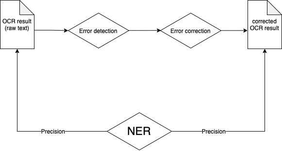

# OCR-NER

This repository contains code developed for spell checking the raw OCRised French texts in the TEI-XML format issued from the [Très Grande Bibliothèque](http://obvil.lip6.fr/tgb/) (TGB).

Three spellchecking libraries have been tested: [`pyspellchecker`](https://github.com/barrust/pyspellchecker), [`pyenchant`](https://github.com/pyenchant/pyenchant) and [`jamspell`](https://github.com/bakwc/JamSpell), with the aim to compare the two approaches in terms of their general performance:

1. approach by dictionary (`pyspellchecker` and `pyenchant` );
2. machine-learning approach  (`jamspell`).

The ultimate goal was not the correction post-OCR _per se_, but the valorisation and the exploitation of the corpus via the named entity recognition (NER) method, in order to determine the impact of the spellchecking libraries on the NER task.

The code for spellchecking the texts with `pyenchant` was originally written by Nicolas Hiebel, the former intern of the former OBVIL Laboratory of Excellence (cf. the original [repo](https://github.com/Hiebel/Stage-OBVIL-2020/tree/master/Python). 

